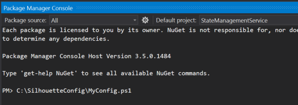
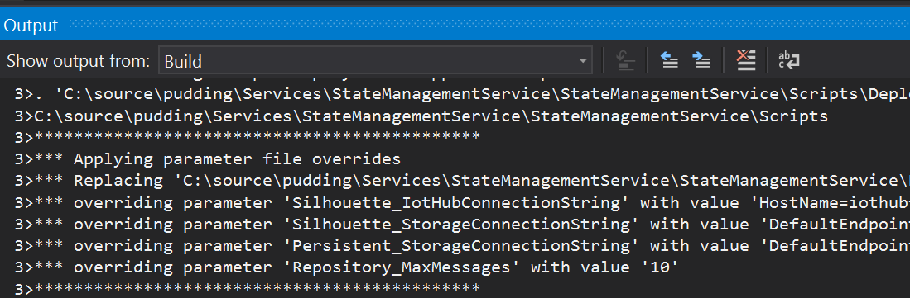

## Configuration

In this repository all configurations are driven by environment variables. 

### Configuration for StateManagementService

#### Getting started

The config for StateManagementService is driven by environment variables. The easiest way to work with this is to create a MyConfig.ps1 script that sets the variables

```posh
$env:Silhouette_IotHubConnectionString="HostName=yourhub.azure-devices.net;SharedAccessKeyName=hubowner;SharedAccessKey=JHMBDjasb12masbdk1289askbsd9SjfHkJSFjqwhfqq="
$env:Silhouette_StorageConnectionString="DefaultEndpointsProtocol=https;AccountName=yourstorage;AccountKey=JkafnSADl34lNSADgd09ldsmnMASlfvmsvds9sd23dmvdsv/9dsv/sdfkjqwndssdljkvds9kjKJHhfds9Jjha=="
$env:Persistent_StorageConnectionString="DefaultEndpointsProtocol=https;AccountName=yourstorage;AccountKey=JkafnSADl34lNSADgd09ldsmnMASlfvmsvds9sd23dmvdsv/9dsv/sdfkjqwndssdljkvds9kjKJHhfds9Jjha=="
$env:Repository_MessagesRetentionMilliseconds = 120000
$env:Repository_MessagesTimerInterval=1
$env:Repository_MinMessagesToKeep=3
```

If you are deploying through Visual Studio then run the script in the Package Manager Console before running the Publish.



When you Deploy (either to publish, or to run/debug locally) you should see output similar to what is shown below in the Output Window.




If you are deploying from PowerShell then simply run the script before runnigng the Deploy-FabricApplication.ps1 script.

#### Meanings of the settings

| Name                                           | Description |
|------------------------------------------------|-------------|
| Silhouette_IotHubConnectionString              | The connection string for the IoT Hub to use to communicate with devices |
| Silhouette_StorageConnectionString             | The connection string used to synchronise consuming messages across partitions of the IoT Hub |
| Persistent_StorageConnectionString             | The connection string to the storage account to write the blob history to |
| Repository_MessagesRetentionMilliseconds       | The minimum time period to retain state messages for in the actor (in milliseconds) |
| Repository_MessagesTimerInterval				       | Messages purge and persist interval in minutes |
| Repository_MinMessagesToKeep				        	 | Minimum number of messages to store in repository memory after purge action |

#### Rationale
There are two approaches to configuration in .NET services on Service Fabric
* standard .NET app.config/web.config
* through [Service Fabric configuration](https://azure.microsoft.com/en-us/documentation/articles/service-fabric-cloud-services-migration-worker-role-stateless-service/#configuration-settings)

With the app.config approach the configuration is baked into the package that is deployed and cannot be changed without rebuilding the package.

With the Service Fabric configuration approach the configuration each project defines its settings in PackageRoot/Config/Settings.xml, but these can be overridden with ConfigOverride sections in the ApplicationPackageRoot/ApplicationManifest.xml in the Service Fabric project. In turn, the settings in the ApplicationManifest can be overridden at deployment time with an Application Parameters file. The Visual Studio project template creates two (Cloud.xml and Local.xml) in the ApplicationParameters folder. The deployment script (Scripts/Deploy-FabricApplication) passes the parameter file to the Publish-*ServiceFabricApplication cmdlets when deploying the application.

```
    Project settings (MyService/PackageRoot/Config/Settings.xml)
     --> overridden by Service Fabric Application Settings (MyServiceFabricApp/ApplicationPackageRoot/ApplicationManifest.xml)
       --> overridden by Parameters File at deploy time (MyServiceFabricApp/ApplicationParameters/<profile>.xml)
```

One advantage of using the Service Fabric configuration approach is the ability to control the configuration at deployment time, i.e. use the same package but deploy it with different configuration options without rebuilding

The downside is that the tools make it too easy to put your production configuration settings (e.g. access keys) into source control. To work around this, the solution has taken an approach where the application parameters file is generated dynamically when deploying based using environment variables. The core logic in in Scripts/Override-Parameters.ps1. The publish profile points to the &lt;profile&gt;-generated.xml in the ApplicationParameters folder. The script uses the &lt;profile&gt;.xml file as a starting point and writes the values to the generated version applying overrides from environment variables. Since .gitignore only applies to new files, the files can't be in source control with changes ignored. Additionally, the current Service Fabric project doesn't support 

By using environment variables it is easy to create scripts for each of the environments that you wish to target. Running the script sets the environment variables for the deployment process to use.

One potential issue with this approach is that the application configuration settings are visible in Service Fabric Explorer. This may be something that you find useful, but if it is an issue then you probably want to encrypt the settings (as supported by Service Fabric using certificates)

#### Implementation in code
You can access the Service Fabric configuration through the `System.Fabric.ServiceContext` reference that is passed into your service factory (often just a delegate on the ServiceRuntime.RegisterServiceAsync call). 

To simplify working with the configuration, the solution has a ServiceFabricUtilities project with some configuration helpers. These allow you to access the configuration in a way that feels similar to the way ConfigurationManager allowed access to AppSettings in app.config.

```csharp
var configurationSection = context.GetConfigurationSection("CommunicationProviderServiceSettings");
string iotHubConnectionString = configurationSection["IotHubConnectionString"];
string storageConnectionString = configurationSection["StorageConnectionString"];
```
