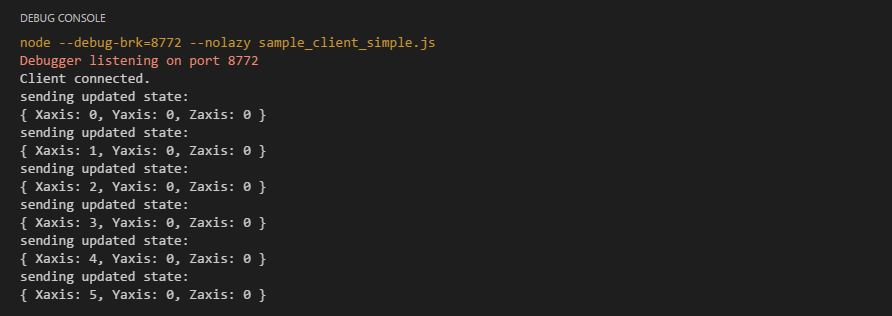
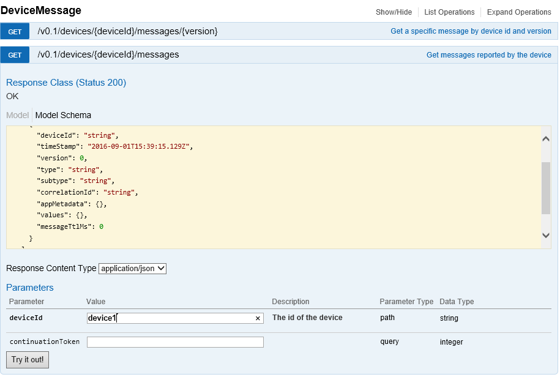
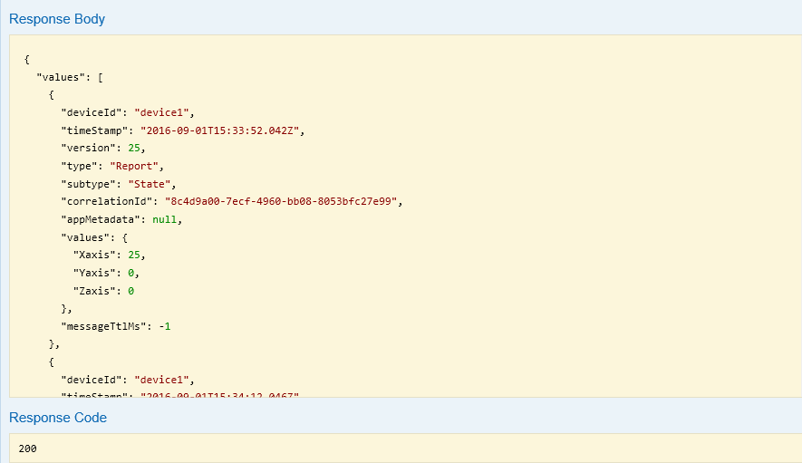

# Setting the development environment

## Installations

**Must have** components in order to run the service and the client:

1. Visual Studio 2015 Update 3
2. Azure Service Fabric SDK - follow the instructions on [service fabric get started](https://azure.microsoft.com/en-us/documentation/articles/service-fabric-get-started/) for installation.
3. Node.js - This is required for running the node.js client sample

Components for **enhanced features** in this repro:

1. Spec Flow - This is required for running the test project, install can be found [here](https://visualstudiogallery.msdn.microsoft.com/c74211e7-cb6e-4dfa-855d-df0ad4a37dd6 )
2. Windows 10 Universal Windows Platform (UWP) SDK - Required for running the Home Lights Sample App.

Additional **recommended tools**:

1. VS Code - You may want to use it for running and debugging node.js
2. [Azure IoT Hub Device Explorer](https://github.com/Azure/azure-iot-sdks/blob/master/tools/DeviceExplorer/doc/how_to_use_device_explorer.md)


## Create Required Azure Services:

Create the following Azure resources and take a note of their connection strings:

1. Azure IoTHub 
2. Azure Storage Account (We will use Blob only)

## Create Configuration File


All configurations in this repro are driven by environment variables. 
Detailed explanation about this approach can be found in the [Configuration](configuration.md) section.
Create MyConfig.ps1 script that sets the variables like in this example and save it:


```posh
$env:Silhouette_IotHubConnectionString="HostName=yourhub.azure-devices.net;SharedAccessKeyName=hubowner;SharedAccessKey=JHMBDjasb12masbdk1289askbsd9SjfHkJSFjqwhfqq="
$env:Silhouette_StorageConnectionString="DefaultEndpointsProtocol=https;AccountName=yourstorage;AccountKey=JkafnSADl34lNSADgd09ldsmnMASlfvmsvds9sd23dmvdsv/9dsv/sdfkjqwndssdljkvds9kjKJHhfds9Jjha=="
$env:Persistent_StorageConnectionString="DefaultEndpointsProtocol=https;AccountName=yourstorage;AccountKey=JkafnSADl34lNSADgd09ldsmnMASlfvmsvds9sd23dmvdsv/9dsv/sdfkjqwndssdljkvds9kjKJHhfds9Jjha=="
$env:Repository_MessagesRetentionMilliseconds = 120000
$env:Repository_MessagesTimerInterval=1
$env:Repository_MinMessagesToKeep=3
```

## Running the service

1.	If you have not done yet, clone this repository to your development machine.
2.	Run Visual Studio as Administrator and open Services/StateManagementService/StateManagementService.sln
3.	Make sure StateManagementService is set as the startup project.
4.	In VS, open Package Manager Console and run the MyConfig.ps1 file you created. This will set the environment variables.
5.	Run the project by pressing Start. This will deploy the service to the local Service Fabric Cluster.
6.	Once the Service deployment is completed check its availability on: http://localhost/swagger/ui/index
7.	Note: you can change the service port by setting the endpoint in StateManagementServiceWebAPI\PackageRoot\ServiceManifest.xml
8.	If all run successfully you should be able to see the swagger UI:


## Running the node.js sample app

1. The node.js client is located under Client/node/sample_client_simple.js
2. Make sure required  node packages are installed:
  ```modules
  npm install azure-iot-device azure-iot-device-http
  ```
3. Node.JS SDK have not yet implemented system properties properly in the SDK. Below is a workaround in order to be able to access the MessageType.

  Modify the file node_modules\azure-iot-device-http\node_modules\azure-iot-http-base\lib\http.js as follows:

  Find this block of code:
  ```javascript
  /*Codes_SRS_NODE_HTTP_05_010: [If the HTTP response has an 'iothub-correlationid' header, it shall be saved as the correlationId property on the created Message.]*/
  else if (item.toLowerCase() === "iothub-correlationid") {
  msg.correlationId = response.headers[item];
  }
  ```

  Paste this block of code right after the block of code mentioned above:
  ```javascript
    else if (item.search("iothub-app-") === 0) { // starts with iothub-app-
       var propertyName = item.substring("iothub-app-".length);
       msg.properties.add(propertyName, response.headers[item]);
    }
  }
  ```

  For more details, see [azure-iot-sdks #414 - EventData Properties dictionary empty ](https://github.com/Azure/azure-iot-sdks/issues/414)

4. Add a device named "device1" the IoTHub and take a note of its connection string. This can be done using [Device Explorer](https://github.com/Azure/azure-iot-sdks/releases/download/2016-02-03/SetupDeviceExplorer.msi).

5. Set environment variables: 


  Same as the service, the config for sample_client_simple.js and sample_client_interactive.js use the environment variables.
This client expects to find environment variable for "Silhouette_DeviceIotHubConnectionString".
This should be the IoTHub connection string for device with ID "device1".

  The connection string expected format is:
  ```
  HostName=<IoTHubName>.azure-devices.net;DeviceId=device1;SharedAccessKey=<The_Device_SAS_Token_for_IoTHub>
  ```


  When working with VSCODE, you can set the environment variables in the launch.json under "env"

  ```javascript
  {
    "version": "0.2.0",
    "configurations": [
        {
            "name": "Launch",
            "type": "node",
            "request": "launch",
            "program": "${workspaceRoot}/sample_client_simple.js",
            "stopOnEntry": false,
            "args": [],
            "cwd": "${workspaceRoot}",
            "preLaunchTask": null,
            "runtimeExecutable": null,
            "runtimeArgs": [
                "--nolazy"
            ],
            "env": {
                "NODE_ENV": "development",
                "Silhouette_DeviceIotHubConnectionString": "HostName=<IoTHubName>.azure-devices.net;DeviceId=device1;SharedAccessKey=<The_Device_SAS_Token_for_IoTHub>"
            },
            "externalConsole": false,
            "sourceMaps": false,
            "outDir": null
        },
        {
            "name": "Attach",
            "type": "node",
            "request": "attach",
            "port": 5858,
            "address": "localhost",
            "restart": false,
            "sourceMaps": false,
            "outDir": null,
            "localRoot": "${workspaceRoot}",
            "remoteRoot": null
        }
    ]
}
  ```

6. Run sample_client_simple.js - it will send messages to IoTHub Device2Cloud endpoint for Device Silhouette to capture and process. The same client will read messages from the Cloud2Device endpoint. 

  ```node
  node sample_client_new.js
  ```

  When running successfully the output will look like this:
  
  
## Test

To test the service and the client together, while both are running go to: http://localhost/swagger/ui/index#!/DeviceMessage/DeviceMessage_GetMessages and set deviceID to device1:



In the response you can see some messages:




