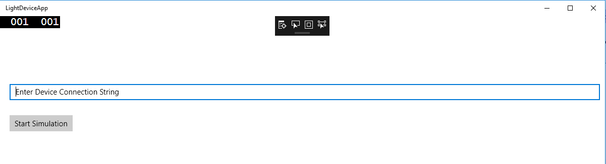
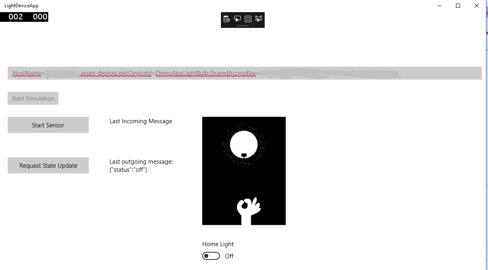
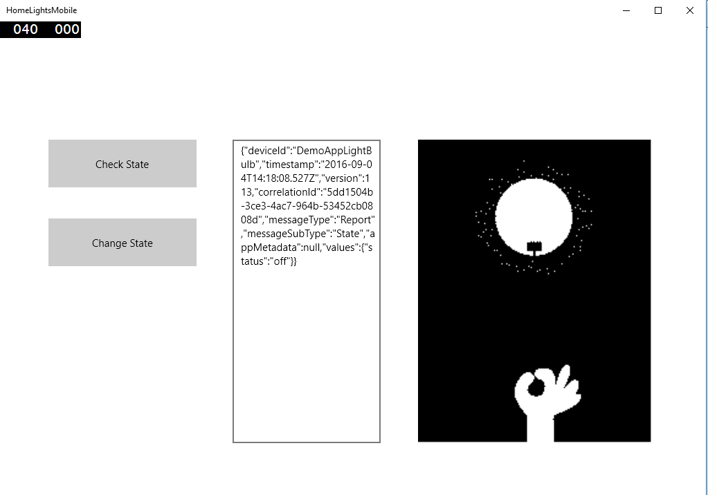

# Sample App

This repository contains a sample app to demonstrate the [Home Lighting Scenario](lightsSampleScenario.md).
The sample app is implemented as a Windows 10 UWP.

The code for the sample app is under SampleApp/SampleApp.sln

The sample includes one device named *DemoAppLightBulb*.
The state of the device can be one of the two possible states values below:

```

"values": {
        "status": "off"
      }
```
```
      
"values": {
        "status": "on"
      },

```


The sample app comprised from two UWP apps:

1. HomeLightsMobile - Simulates a mobile device to control home light remotely. It enables to get the light state and switch the light state.
2. LightDeviceApp - Simulates the home light, represents the real light state. It also simulates a hard switch to turn on/off the light and a sensor that when enables changes the state once every 60 seconds.


## Run the sample app

1. Make sure UWP SDK is installed on your development machine.
2. Run the StateManagmentService is running locally on port *9013*.
3. Create a device in your IoTHub named *DemoAppLightBulb*. You can create the device using Device Explorer.
4. Open SampleApp/SampleApp.sln. Check to see that both LightAppDevice and HomeLightMobile are configured as Startup project.
        
5. Press Start

6. In the LightDeviceApp window enter the IoTHub connection string for the device named *DemoAppLightBulb* and press "Start Simulation".
        
        
6. At this point you should see in both windows the device state, you will see how the state in both windows in synced.
        
        
        
7. Now on the LightDeviceApp you can press the "Start Sensor" button and you will see the state changes after a minute.


