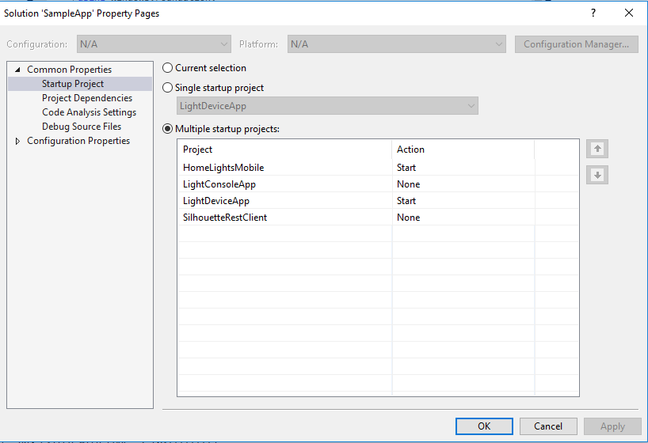

# Sample App

This repository contains a sample app to demonstarte the [Home Ligning Scenario](lightsSampleScenario.md).
The sample app is implementted as a Windows 10 UWP.

The code for the sample app is under SampleApp/SampleApp.sln

The sample includes one device named *DemoAppLightBulb*.
The state of the device can be one of the two posible states values below:

```

"values": {
        "status": "off"
      }
```
```
      
"values": {
        "status": "on"
      },

```


The sample app comprised from two UWP apps:

1. HomeLightsMobile - Simulate a mobile device to control home light remotly. It enables to get the light state and swith the light state.
2. LightDeviceApp - Simulate the home light, represents the real light state. It also simultes a hard switch to turn on/off the light and a sensor that when enables changes the state once every 60 seconds.

## Run the sample app

1. Make sure UWP SDK is installed on your development machine.
2. Run the StateManagmentService is running locally on port *9013*.
2. Create a device in your IoTHub named *DemoAppLightBulb*.
3. Open SampleApp/SampleApp.sln. Check to see that both LightAppDevice and HomeLightMobile are configured as Startup project.
        
4. xvdsv


