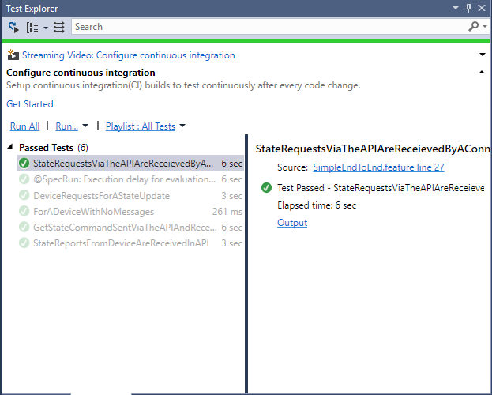

# Test

This repository contains Visual Studio test projects for functionality and load tests.
The test projects are located under SilhouetteTests folder. There you can find the SilhouetteTests.sln with all projects.

## Silhouette.EndToEndTests

### Installation

Make sure [Spec Flow](https://visualstudiogallery.msdn.microsoft.com/c74211e7-cb6e-4dfa-855d-df0ad4a37dd6 ) is installed on your test machine.

### Configuration

In this project the configuration is driven by environment variables, same as in other projects in this repository and documented in the [configuration](configuration.md) section.

Create MyTestConfig.PS1 configuration file as in this example:

```posh
$env:Silhouette_IotHubConnectionString="HostName=yourhub.azure-devices.net;SharedAccessKeyName=hubowner;SharedAccessKey=JHMBDjasb12masbdk1289askbsd9SjfHkJSFjqwhfqq="
```

To set the environment variables run MyTestConfig.PS1 from Package Manager Console before running the test.

Note: If test fails due to missing connection string, close and reopen Visual Studio, immedietly run MyTestConfig.PS1 and then try again to run the test.

### API endpoint

This project expects the services to be running locally on port 80.

### Create devices in IoT Hub for test

Create two devices in IoTHub for test, you can create the devices using Device Explorer.
Devices names to create:
1. e2eDevice1
2. e2eDevice2

### Run the tests

Make sure the StatemanagmentService is running locally in port 80.

In Visual Studio, open Test Explorer. If you can't find it open it from the Test menue: Test\Windows\Test explorer.
There you will see a list of the existing test, to run or debug a test right click the test and run it.




## Silhouette.LoadTest


## Silhouette.SimpleWebTest

This is a very simple web test.
It calls the GET /v0.1/devices/{deviceId}/messages operation for a registered device name device1.
To test make sure the service is running on http://localhost:80 and the sample_client_simple.js is running with device1.
The test verify the expected http return code: 200 and a valid JSON in the response body.
