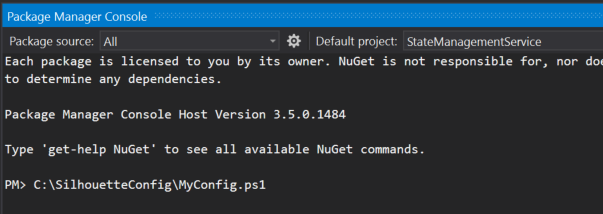

# Device Silhouette

This project creates a virtual version or actor (“silhouette”) of each device in the cloud that includes the device’s latest state so that applications interact with the device even when the device is offline. The Device Silhouettes persist the last reported state and desired future state. You can retrieve the last reported state of a device or set a desired future state through a Rest API or using one of the Client SDKs


## Setting up the project
There are 2 channels to communicate with the Device Silhouette:

1. Direct REST API
2. Messaging Communication Provider -currently implemented only IoTHub.

Setup the following Azure Services and take a note of their connection string:
1. Azure IoTHub
2. Azure Storage Account

Clone this repository, and compile the Visual Studio solution under [Services/StateManagementService](Services/StateManagementService). 
Update the connection strings for IoTHub and storage in the StateProcessorService app.config file

The Device Silhouette is a Service Fabric application. You can run the solution on your local machine (set the StateManagementService as the startup project), using a local cluster of Service Fabric, or deploy it to Azure Service Fabric cluster. 

[Prepare your development environment](https://azure.microsoft.com/en-us/documentation/articles/service-fabric-get-started/)
 
## Testing IoTHub communicator using a node.js client
Add a device to the IoTHub and take a note of its name and connection string. This can be done using [Device Explorer](https://github.com/Azure/azure-iot-sdks/releases/download/2016-02-03/SetupDeviceExplorer.msi).

The node.js client is located under [Client/node](Client/node). Edit the files:

- sample_client_new.js
- silhouette-client-iothub-new.js

And replace connectionString with the device connection string, and DeviceID with the device name.

Install the IOT modules needed

```modules
npm install azure-iot-device azure-iot-device-http
```

Run sample_client_new.js - it will send messages to IoTHub Device2Cloud endpoint for Device Silhouette to capture and process. The same client will read messages from the Cloud2Device endpoint. 

```node
node sample_client_new.js
```

## Testing REST APIs using Swagger
The visual studio solution contains a swagger UI for the REST APIs. 

If run locally, can be accessed via [http://localhost:9013/swagger/ui/index](http://localhost:9013/swagger/ui/index). Alternatively, if a Service Fabric cluster is deployed in Azure, the swagger UI can be accessed at [<cluster url>:9013/swagger/ui/index](<cluster url>:9013/swagger/ui/index).


## Setting configuration

### StateManagementService

#### Getting started

The config for StateManagementService is driven by environment variables. The easiest way to work with this is to create a MyConfig.ps1 script that sets the variables

```posh
$env:Silhouete_IotHubConnectionString="HostName=yourhub.azure-devices.net;SharedAccessKeyName=hubowner;SharedAccessKey=JHMBDjasb12masbdk1289askbsd9SjfHkJSFjqwhfqq="
$env:Silhouete_StorageConnectionString="DefaultEndpointsProtocol=https;AccountName=yourstorage;AccountKey=JkafnSADl34lNSADgd09ldsmnMASlfvmsvds9sd23dmvdsv/9dsv/sdfkjqwndssdljkvds9kjKJHhfds9Jjha=="
```

If you are deploying through Visual Studio then run the script in the Package Manager Console before running the Publish.



If you are deploying from PowerShell then simply run the script before runnigng the Deploy-FabricApplication.ps1 script.

#### Rationale
There are two approaches to configuration in .NET services on Service Fabric
* standard .NET app.config/web.config
* through [Service Fabric configuration](https://azure.microsoft.com/en-us/documentation/articles/service-fabric-cloud-services-migration-worker-role-stateless-service/#configuration-settings)

With the app.config approach the configuration is baked into the package that is deployed and cannot be changed without rebuilding the package.

With the Service Fabric configuration approach the configuration each project defines its settings in PackageRoot/Config/Settings.xml, but these can be overridden with ConfigOverride sections in the ApplicationPackageRoot/ApplicationManifest.xml in the Service Fabric project. In turn, the settings in the ApplicationManifest can be overridden at deployment time with an Application Parameters file. The Visual Studio project template creates two (Cloud.xml and Local.xml) in the ApplicationParameters folder. The deployment script (Scripts/Deploy-FabricApplication) passes the parameter file to the Publish-*ServiceFabricApplication cmdlets when deploying the application.

```
    Project settings (MyService/PackageRoot/Config/Settings.xml)
     --> overridden by Service Fabric Application Settings (MyServiceFabricApp/ApplicationPackageRoot/ApplicationManifest.xml)
       --> overridden by Parameters File at deploy time (MyServiceFabricApp/ApplicationParameters/<profile>.xml)
```

One advantage of using the Service Fabric configuration approach is the ability to control the configuration at deployment time, i.e. use the same package but deploy it with different configuration options without rebuilding

The downside is that the tools make it too easy to put your production configuration settings (e.g. access keys) into source control. To work around this, the solution has taken an approach where the application parameters file is generated dynamically when deploying based using environment variables. The core logic in in Scripts/Override-Parameters.ps1. This script looks generated a new, temporary parameters file. If any parameters in the file have matching environment variables then the value of the environment variable is used in the temporary file. In the main Deploy-FabricApplication.ps1 there is a call to CreateParametersFileWithEnvironmentOverrides to generate the temporary file and substitute into the deployment process.

By using environment variables it is easy to create scripts for each of the environments that you wish to target. Running the script sets the environment variables for the deployment process to use.

One potential issue with this approach is that the application configuration settings are visible in Service Fabric Explorer. This may be something that you find useful, but if it is an issue then you probably want to encrypt the settings (as supported by Service Fabric using certificates)

#### Implementation in code
You can access the Service Fabric configuration through the `System.Fabric.ServiceContext` reference that is passed into your service factory (often just a delegate on the ServiceRuntime.RegisterServiceAsync call). 

To simplify working with the configuration, the solution has a ServiceFabricUtilies project with some configuration helpers. These allow you to access the configuration in a way that feels similar to the way ConfigurationManager allowed access to AppSettings in app.config.

```csharp
            var configurationSection = context.GetConfigurationSection("CommunicationProviderServiceSettings");
            string iotHubConnectionString = configurationSection["IotHubConnectionString"];
            string storageConnectionString = configurationSection["StorageConnectionString"];
```

